# Visualization
# [Pie Chart](#pie)
# [Bar Chart](#bar)
   - [Countplot](#countplot)
   - [Barplot](#barplot)
   - [Pointplot](#pointplot)
   
# [Histogram](#histogram)
# [Scatter Plot](#scatter)
# [Box Plot](#boxplot)
# [Violin Plot](#violin)

## Introduction <a name="introduction"></a>

**Problem:**
The World Health Organization has estimated 12 million deaths occur worldwide, every year due to Heart diseases. Half the deaths in the United States and other developed countries are due to cardio vascular diseases. The early prognosis of cardiovascular diseases can aid in making decisions on lifestyle changes in high risk patients and in turn reduce the complications. This research intends to pinpoint the most relevant/risk factors of heart disease as well as predict the overall risk using logistic regression Data Preparation

**Source:**
The dataset is publically available on the Kaggle website, and it is from an ongoing cardiovascular study on residents of the town of Framingham, Massachusetts. The classification goal is to predict whether the patient has 10-year risk of future coronary heart disease (CHD).The dataset provides the patients’ information. It includes over 4,000 records and 15 attributes. Variables Each attribute is a potential risk factor. There are both demographic, behavioral and medical risk factors.

**Attributes:**

#### Demographic: 
* Sex: male or female(Nominal) 
* Age: Age of the patient;(Continuous - Although the recorded ages have been truncated to whole numbers, the concept of age is continuous) 
* Education: no further information provided

#### Behavioral: 
* Current Smoker: whether or not the patient is a current smoker (Nominal) 
* Cigs Per Day: the number of cigarettes that the person smoked on average in one day.(can be considered continuous as one can have any number of cigarettes, even half a cigarette.) 

#### Information on medical history: 
* BP Meds: whether or not the patient was on blood pressure medication (Nominal) 
* Prevalent Stroke: whether or not the patient had previously had a stroke (Nominal) 
* Prevalent Hyp: whether or not the patient was hypertensive (Nominal) 
* Diabetes: whether or not the patient had diabetes (Nominal) 

#### Information on current medical condition: 
* Tot Chol: total cholesterol level (Continuous) 
* Sys BP: systolic blood pressure (Continuous) 
* Dia BP: diastolic blood pressure (Continuous) 
* BMI: Body Mass Index (Continuous) 
* Heart Rate: heart rate (Continuous - In medical research, variables such as heart rate though in fact discrete, yet are considered continuous because of large number of possible values.) 
* Glucose: glucose level (Continuous) 

#### Target variable to predict: 
* 10 year risk of coronary heart disease (CHD) - (binary: “1”, means “Yes”, “0” means “No”)

Source: https://www.kaggle.com/dileep070/heart-disease-prediction-using-logistic-regression


```python
import warnings
warnings.filterwarnings('ignore')
import pandas as pd
import matplotlib.pyplot as plt
import numpy as np
import seaborn as sns

%matplotlib inline
```


```python
#loading the dataset
df = pd.read_csv('framingham.csv')
df.head()
```


<div>
<style scoped>
    .dataframe tbody tr th:only-of-type {
        vertical-align: middle;
    }

    .dataframe tbody tr th {
        vertical-align: top;
    }

    .dataframe thead th {
        text-align: right;
    }
</style>
<table border="1" class="dataframe">
  <thead>
    <tr style="text-align: right;">
      <th></th>
      <th>male</th>
      <th>age</th>
      <th>education</th>
      <th>currentSmoker</th>
      <th>cigsPerDay</th>
      <th>BPMeds</th>
      <th>prevalentStroke</th>
      <th>prevalentHyp</th>
      <th>diabetes</th>
      <th>totChol</th>
      <th>sysBP</th>
      <th>diaBP</th>
      <th>BMI</th>
      <th>heartRate</th>
      <th>glucose</th>
      <th>TenYearCHD</th>
    </tr>
  </thead>
  <tbody>
    <tr>
      <th>0</th>
      <td>1</td>
      <td>39</td>
      <td>4.0</td>
      <td>0</td>
      <td>0.0</td>
      <td>0.0</td>
      <td>0</td>
      <td>0</td>
      <td>0</td>
      <td>195.0</td>
      <td>106.0</td>
      <td>70.0</td>
      <td>26.97</td>
      <td>80.0</td>
      <td>77.0</td>
      <td>0</td>
    </tr>
    <tr>
      <th>1</th>
      <td>0</td>
      <td>46</td>
      <td>2.0</td>
      <td>0</td>
      <td>0.0</td>
      <td>0.0</td>
      <td>0</td>
      <td>0</td>
      <td>0</td>
      <td>250.0</td>
      <td>121.0</td>
      <td>81.0</td>
      <td>28.73</td>
      <td>95.0</td>
      <td>76.0</td>
      <td>0</td>
    </tr>
    <tr>
      <th>2</th>
      <td>1</td>
      <td>48</td>
      <td>1.0</td>
      <td>1</td>
      <td>20.0</td>
      <td>0.0</td>
      <td>0</td>
      <td>0</td>
      <td>0</td>
      <td>245.0</td>
      <td>127.5</td>
      <td>80.0</td>
      <td>25.34</td>
      <td>75.0</td>
      <td>70.0</td>
      <td>0</td>
    </tr>
    <tr>
      <th>3</th>
      <td>0</td>
      <td>61</td>
      <td>3.0</td>
      <td>1</td>
      <td>30.0</td>
      <td>0.0</td>
      <td>0</td>
      <td>1</td>
      <td>0</td>
      <td>225.0</td>
      <td>150.0</td>
      <td>95.0</td>
      <td>28.58</td>
      <td>65.0</td>
      <td>103.0</td>
      <td>1</td>
    </tr>
    <tr>
      <th>4</th>
      <td>0</td>
      <td>46</td>
      <td>3.0</td>
      <td>1</td>
      <td>23.0</td>
      <td>0.0</td>
      <td>0</td>
      <td>0</td>
      <td>0</td>
      <td>285.0</td>
      <td>130.0</td>
      <td>84.0</td>
      <td>23.10</td>
      <td>85.0</td>
      <td>85.0</td>
      <td>0</td>
    </tr>
  </tbody>
</table>
</div>


<a id='pie'></a>
# Pie Chart


```python
plt.pie(df['TenYearCHD'].value_counts(), labels=['No','Yes'],autopct='%1.1f%%')
plt.show()
```


    

    


- In this dataset we will be predicting whether the person will have  10 year risk of coronary heart disease or not. Our Target variable is 'TenYearCHD'. From the above plot we can say that 85% of the people will not have 10 year risk of coronary heart disease and 15% of the people will have 10 year risk of coronary heart disease. Using the above plot, we can say that it is a imbalanced dataset and it is very important to choose the right metric such as f1score to evaluate the model trained using this dataset .

- We can use pie chart to visualize what is the percentage of each target class available for training and also check whether the sampled categorical data is biased or not by checking the whether all the values of each feature have same proportion or not using pie chart.


- Using pie chart we can only get the count/percentage of each categorical feature. We can't compare multiple categorcial features or categorical with numeric data using the pie chart.


```python
#example to understand issues of pie chart
reviews_percentage = [90,95,93,85,80]
plt.pie(reviews_percentage, labels=['Football','Soccer','Baseball', 'Volleyball','Others'],autopct='%d%%')
plt.title('% Players Satisifed')
plt.show()
```


    

    


<a id='bar'></a>
# Bar Chart

- We use a bar chart when we are dealing with the categorical data


```python
#pie chart v/s bar chart
reviews_percentage = [95,93,90,85,80]
labels=['Football', 'Soccer', 'Baseball', 'Volleyball', 'Others']
plt.bar(labels, reviews_percentage)
plt.title('% players satisfied')
plt.show()
```


    
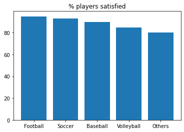
    


- From the above plot we can understand better when compared with pie chart.

- We can clearly see what % of players are satisified with each game.

- Usually we plot the bars in descending order (i.e. highest is first)

Now lets plot a bar chart for the given dataset.


```python
#using matplotlib
#bar plot for smoker's/non-smokers

value_counts = df['currentSmoker'].value_counts()
labels = value_counts.index
counts = value_counts.values

plt.bar(labels,counts)
plt.xticks([0,1])
plt.ylabel('count')
plt.xlabel('currentSmoker')
plt.show()
```


    
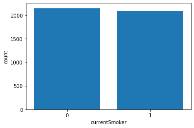
    


- From the above plot we can say that number of currentSmokers is equal to number of non-currentSmokers in the dataset.

- If you look at the code carefully, we have manually entered the xticks, xlabel and ylabel for the plot manually. If you don't want to go through all that you could do it by plotting the graphs using seaborn package instead of matplotlib. 

- Seaborn library is built on top of Matploltib library. We could work with dataframes directly when we use seaborn library. You could learn about the features of seaborn here.

- Seaborn plots important parameters:
   - x: data to plot on x-axis
   - y: data to plot on y-axis
   - hue: data for color encoding
   - data: Dataframe, array or list of arrays 
- Note:
    - Use categorical data for hue


<a id='countplot'></a>
### Countplot
 - Shows the counts of values in each categorical feature using bins
 - We can't use data on both x-axis and y-axis to plot countplot but we can use either on x-axis or y-axis and hue.
 - <a href='https://seaborn.pydata.org/generated/seaborn.countplot.html'>read more about countplot here</a>


```python
#using seaborn
#count plot for smoker's/non-smokers

#currentSmoker on x-axis
sns.countplot(x='currentSmoker',data = df)
plt.title('Vertical Countplot')
plt.show()

#currentSmoker on y-axis
sns.countplot(y='currentSmoker',data = df)
plt.title('Horizontal Countplot')
plt.show()
```


    
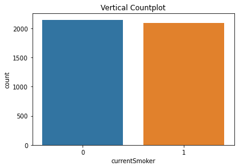
    


    
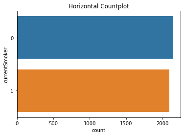
    


```python
#using seaborn
#count plot for smoker's/non-smokers and male features

#currentSmoker on x-axis and male feature as hue
sns.countplot(x='currentSmoker', hue='male',data = df)
plt.title('currentSmoker v/s Male vertical plot')
plt.show()


#currentSmoker on y-axis and male feature as hue
sns.countplot(y='currentSmoker', hue='male',data = df)
plt.title('currentSmoker v/s Male horizontal plot')
plt.show()
```


    
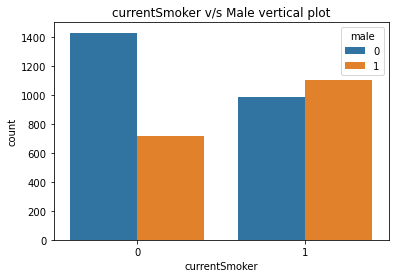
    


    
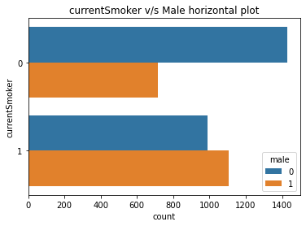
    


- By now, I hope you have understood what is x, y, hue and data parameters.
- Horizontal bar charts are just like vertical bar charts except that the axes are flipped round. With horizontal bar charts, we show the categories on the vertical axis and the frequency or percentage on the horizontal axis.
- As you can see, it’s much easier to quickly gauge which category has the highest value, and which the lowest when we use horizontal bar charts.
- In seaborn, using the countplots we only get the counts. But what if we want to use other than count? 
- Then barplot comes to our rescue.

<a id='barplot'></a>
### Bar Plot
- Bar plot shows the point estimates and confidence intervals.  
- In a bar plot, the height of each rectangle indicates the central tendency of a numeric variable and it also provides the uncertainty around that estimate.
- By default the estimator is mean.
- <a href='https://seaborn.pydata.org/generated/seaborn.barplot.html'>read more here</a>


```python
sns.barplot(y='BMI',x='TenYearCHD',data=df)
plt.show()
```


    
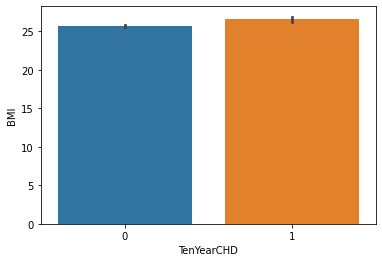
    


- From the above plot, we can say that the people who has more BMI has more probability of having the risk of heart disease.


```python
sns.barplot(x='currentSmoker', y='BMI',data=df, estimator=np.median)
plt.show()
```


    
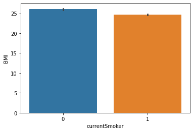
    


- From this plot, we can say that current smoker has less bmi value compared to non-smoker.


```python
sns.barplot(x='currentSmoker', y='BMI',hue='male',data=df)
plt.show()
```


    
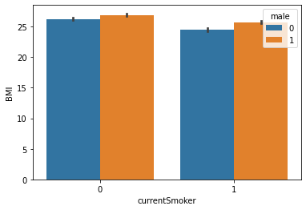
    


- From the above plot, we can say that the males have higher BMI compared to others and also current smoker has less BMI compared to non smoker


```python
sns.barplot(x='currentSmoker', y='age',hue='TenYearCHD',data=df)
plt.show()
```


    
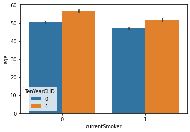
    


- From the above plot, we can say that the age of people who will have heart disease is higher than the age of people who doesn't have it. If the person is current smoker then the average age decreases further.


```python
sns.barplot(x='diabetes', y='heartRate',hue='male',data=df)
plt.show()
```


    

    


- From the above plot we can say that the people who has diabetes has more heart rate compared to the people who doesn't have diabetes and also the heart rate for males is less than others.

<a id='pointplot'></a>
### PointPlot
- Pointplot is similar to barplot but instead of rectangular bars we have scatter plot points to represent the point estimates and confidence intervals.
- <a href='https://seaborn.pydata.org/generated/seaborn.pointplot.html#seaborn.pointplot'>seaborn pointplot</a>


```python
sns.pointplot(x='diabetes', y='heartRate',hue='male',data=df)
plt.show()
```


    
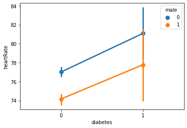
    


- We infer same as above barplot but it is easier for our eyes to understand the relationship between heartrate, diabetes and gender when we use pointplot.
- Till now we have dealt with categorical features and at max one numerical feature but what if we want to understand distribution of a numerical feature? 
- We can't use a bar chart.
- Now, we will using Histogram.

<a id='histogram'></a>

# Histogram

### Histplot
- It represents the distribution of a numerical feature that are within discrete bins
- Important parameter:
    - bins: number of bins


```python
#visualizing the distribution of age
sns.histplot(x='age', bins=10, data=df)
plt.show()
```


    
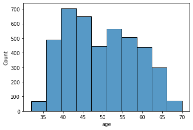
    


- From above plot we can say that the minimum age is some where near 17 and maximum age is 70.
- Mode(Highest frequency) is when age is in 40-45 range.
- Distribution of Age is right skewed.


```python
#visualizing the age and male features
sns.histplot(x='age',hue='male', data=df)
plt.show()
```


    
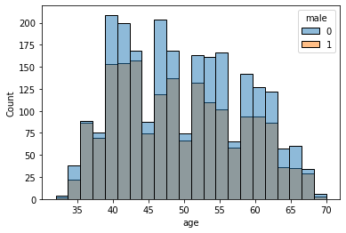
    


<a id='boxplot'></a>
# Box Plot
- It shows the comparision of distribution of different values of a feature or two different features.
- <a href='https://seaborn.pydata.org/generated/seaborn.boxplot.html'>Seaborn Documentation</a>


```python
sns.boxplot(x='male',y='heartRate', hue='currentSmoker', data=df)
plt.show()
```


    
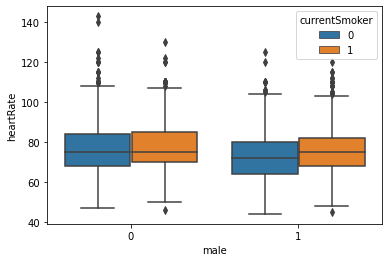
    


<a id='violin'></a>
# Violin Plot
- It draws a combination of boxplot and kernel density estimate.


```python
sns.violinplot(x='male',y='heartRate', hue='currentSmoker', data=df)
plt.show()
```


    
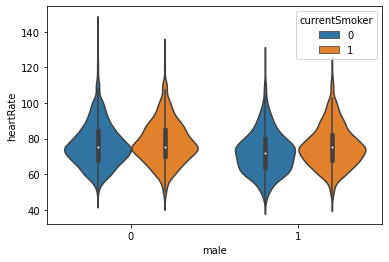
    


<a id='scatter'></a>
# Scatter Plot
- Draws dots to represent values for two different numeric features


```python
sns.scatterplot(x='sysBP',y='diaBP',hue='TenYearCHD', data=df)
plt.show()
```


    
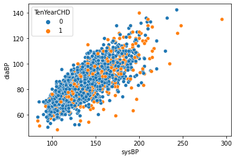
    


- Form above plot we can say that there is a linear relationship between sysBP and diaBP. As sysBP increases diaBP increases.

<a id='strip'></a>
# Strip Plot
- Draws Scatterplot when one variable is categorical


```python
plt.figure(figsize=(10,10))
sns.stripplot(x='male', y='heartRate', hue='currentSmoker',data=df)
plt.show()
```


    
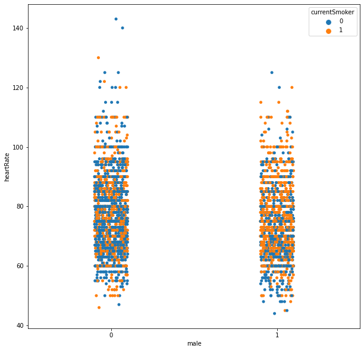
    


<a id='swarm'></a>
# Swarm Plot
- Similar to stripplot but the points are adjusted so that they don't overlap.
- Doesn't scale well when we have large number of observations


```python
plt.figure(figsize=(10,10))
sns.swarmplot(x='male', y='heartRate', hue='currentSmoker',data=df)
plt.show()
```


    
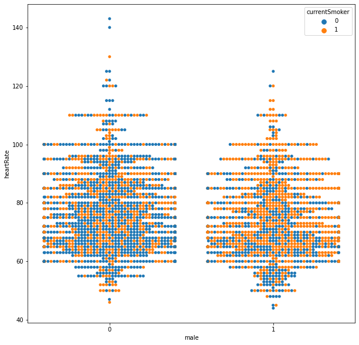
    


### Stripplot and swarm plots are good complements to box/violin plots


```python
plt.figure(figsize=(10,10))
sns.violinplot(x='male',y='heartRate', data=df)
sns.stripplot(x='male', y='heartRate', hue='currentSmoker',color='white',data=df)
plt.show()
```


    
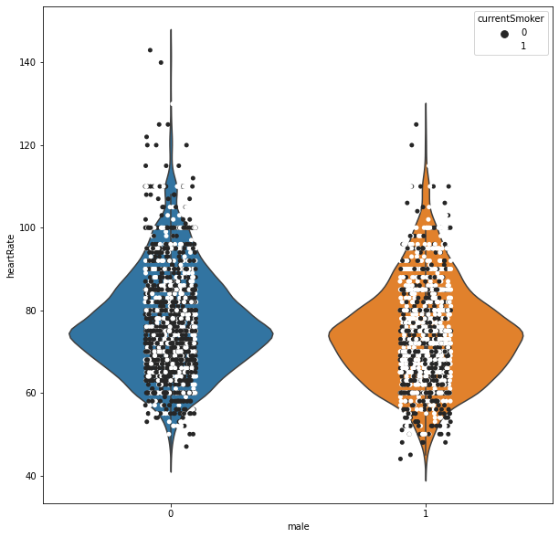
    


```python
plt.figure(figsize=(20,20))
sns.violinplot(x='male',y='heartRate', data=df)
sns.swarmplot(x='male', y='heartRate', hue='currentSmoker',color='white',data=df)
plt.show()
```


    
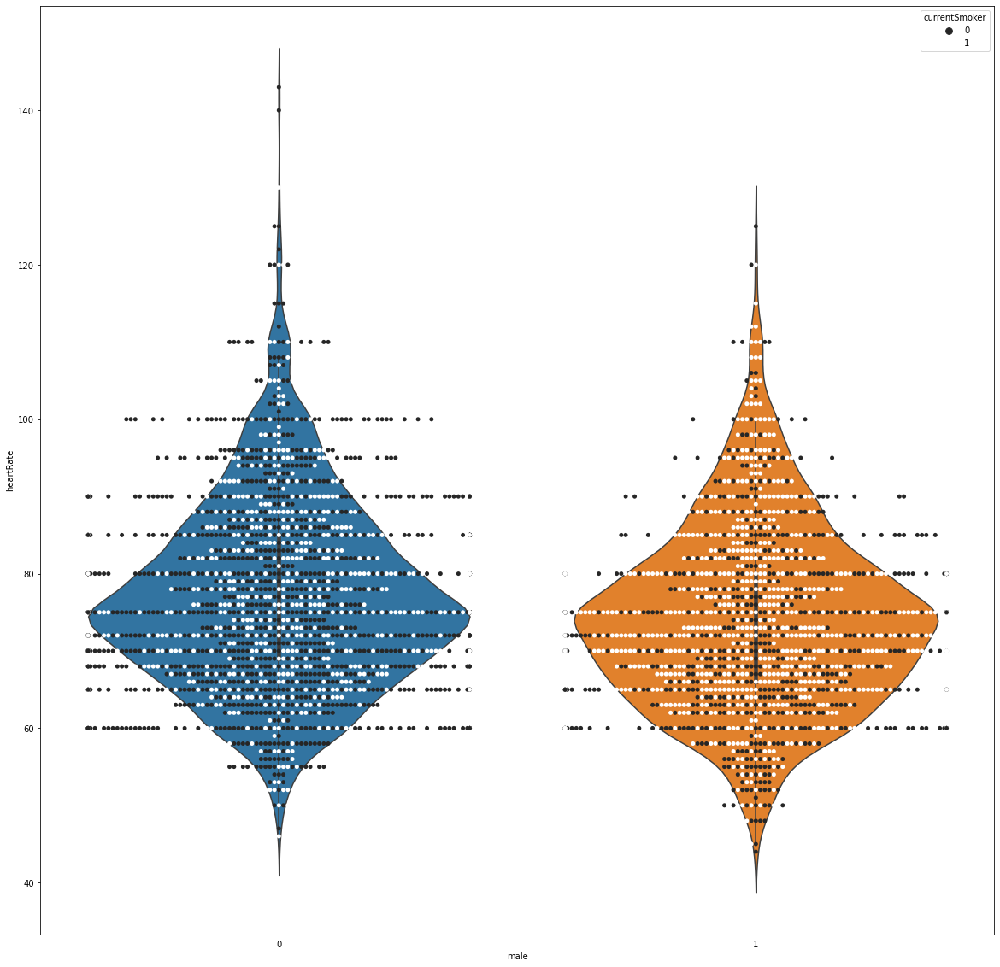
    


 
