## Visualization

- **Basic Plots**
    - [Pie Chart](#pie)
    - [Bar Chart](#bar)
       - [Countplot](#countplot)
       - [Barplot](#barplot)
       - [Pointplot](#pointplot)

    - [Histogram](#histogram)
    - [Box Plot](#boxplot)
    - [Violin Plot](#violin)
    - [Scatter Plot](#scatter)
    - [Strip Plot](#strip)
    - [Swarm Plot](#swarm)
    - [Catplot](#catplot)
- [Leftovers](#leftovers)

[](https://colab.research.google.com/drive/1VDrCunAe8TIJ0AG_MZoeJLF1WjHgBvJS?usp=sharing)

## DataSet <a name="introduction"></a>

Source: https://www.kaggle.com/dileep070/heart-disease-prediction-using-logistic-regression


**Attributes:**

#### Demographic: 
* Sex: male or female(Nominal) 
* Age: Age of the patient;(Continuous - Although the recorded ages have been truncated to whole numbers, the concept of age is continuous) 
* Education: no further information provided

#### Behavioral: 
* Current Smoker: whether or not the patient is a current smoker (Nominal) 
* Cigs Per Day: the number of cigarettes that the person smoked on average in one day.(can be considered continuous as one can have any number of cigarettes, even half a cigarette.) 

#### Information on medical history: 
* BP Meds: whether or not the patient was on blood pressure medication (Nominal) 
* Prevalent Stroke: whether or not the patient had previously had a stroke (Nominal) 
* Prevalent Hyp: whether or not the patient was hypertensive (Nominal) 
* Diabetes: whether or not the patient had diabetes (Nominal) 

#### Information on current medical condition: 
* Tot Chol: total cholesterol level (Continuous) 
* Sys BP: systolic blood pressure (Continuous) 
* Dia BP: diastolic blood pressure (Continuous) 
* BMI: Body Mass Index (Continuous) 
* Heart Rate: heart rate (Continuous - In medical research, variables such as heart rate though in fact discrete, yet are considered continuous because of large number of possible values.) 
* Glucose: glucose level (Continuous) 

#### Target variable to predict: 
* 10 year risk of coronary heart disease (CHD) - (binary: “1”, means “Yes”, “0” means “No”)


```python
#loading packages
import warnings
warnings.filterwarnings('ignore')
import pandas as pd
import matplotlib.pyplot as plt
import numpy as np
import seaborn as sns

%matplotlib inline
```


```python
#loading the dataset
df = pd.read_csv('framingham.csv')
df.head()
```


<div>

<table border="1" class="dataframe">
  <thead>
    <tr style="text-align: right;">
      <th></th>
      <th>male</th>
      <th>age</th>
      <th>education</th>
      <th>currentSmoker</th>
      <th>cigsPerDay</th>
      <th>BPMeds</th>
      <th>prevalentStroke</th>
      <th>prevalentHyp</th>
      <th>diabetes</th>
      <th>totChol</th>
      <th>sysBP</th>
      <th>diaBP</th>
      <th>BMI</th>
      <th>heartRate</th>
      <th>glucose</th>
      <th>TenYearCHD</th>
    </tr>
  </thead>
  <tbody>
    <tr>
      <th>0</th>
      <td>1</td>
      <td>39</td>
      <td>4.0</td>
      <td>0</td>
      <td>0.0</td>
      <td>0.0</td>
      <td>0</td>
      <td>0</td>
      <td>0</td>
      <td>195.0</td>
      <td>106.0</td>
      <td>70.0</td>
      <td>26.97</td>
      <td>80.0</td>
      <td>77.0</td>
      <td>0</td>
    </tr>
    <tr>
      <th>1</th>
      <td>0</td>
      <td>46</td>
      <td>2.0</td>
      <td>0</td>
      <td>0.0</td>
      <td>0.0</td>
      <td>0</td>
      <td>0</td>
      <td>0</td>
      <td>250.0</td>
      <td>121.0</td>
      <td>81.0</td>
      <td>28.73</td>
      <td>95.0</td>
      <td>76.0</td>
      <td>0</td>
    </tr>
    <tr>
      <th>2</th>
      <td>1</td>
      <td>48</td>
      <td>1.0</td>
      <td>1</td>
      <td>20.0</td>
      <td>0.0</td>
      <td>0</td>
      <td>0</td>
      <td>0</td>
      <td>245.0</td>
      <td>127.5</td>
      <td>80.0</td>
      <td>25.34</td>
      <td>75.0</td>
      <td>70.0</td>
      <td>0</td>
    </tr>
    <tr>
      <th>3</th>
      <td>0</td>
      <td>61</td>
      <td>3.0</td>
      <td>1</td>
      <td>30.0</td>
      <td>0.0</td>
      <td>0</td>
      <td>1</td>
      <td>0</td>
      <td>225.0</td>
      <td>150.0</td>
      <td>95.0</td>
      <td>28.58</td>
      <td>65.0</td>
      <td>103.0</td>
      <td>1</td>
    </tr>
    <tr>
      <th>4</th>
      <td>0</td>
      <td>46</td>
      <td>3.0</td>
      <td>1</td>
      <td>23.0</td>
      <td>0.0</td>
      <td>0</td>
      <td>0</td>
      <td>0</td>
      <td>285.0</td>
      <td>130.0</td>
      <td>84.0</td>
      <td>23.10</td>
      <td>85.0</td>
      <td>85.0</td>
      <td>0</td>
    </tr>
  </tbody>
</table>
</div>


<a id='pie'></a>
# Pie Chart


```python
plt.pie(df['TenYearCHD'].value_counts(), labels=['No','Yes'],autopct='%1.1f%%')
plt.title('TenYearCHD %')
plt.show()
```


    
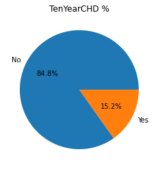
    


- In this dataset we will be predicting whether the person will have 10 year risk of coronary heart disease or not. Our Target variable is 'TenYearCHD'. From the above plot we can say that 85% of the people will not have 10 year risk of coronary heart disease and 15% of the people will have 10 year risk of coronary heart disease. Using the above plot, we can say that it is a imbalanced dataset and it is very important to choose the right metric such as f1score to evaluate the model trained using this dataset .

- We can use pie chart to visualize what is the percentage of each target class available for training and also check whether the sampled categorical data is biased or not by checking whether all the values of each feature have same proportion or not using pie chart.

- Using pie chart we can only get the proportion of each categorical feature.


```python
#example to understand issues of pie chart
reviews_percentage = [90,95,93,85,80]
plt.pie(reviews_percentage, labels=['Football','Soccer','Baseball', 
                                    'Volleyball','Others'],autopct='%d%%')
plt.title('% Players Satisifed')
plt.show()
```


    
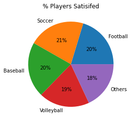
    


### Issues with pie chart:
- If we have the same level of slices, we can't deduce useful information from the pie chart.
- We can't compare multiple categorical features.

### When to use pie-chart?
- Use only when you are dealing with the basic proportions of a feature.

<a id='bar'></a>
# Bar Chart

- We use a bar chart when we are dealing with the categorical data


```python
reviews_percentage = [95,93,90,85,80]
labels=['Football', 'Soccer', 'Baseball', 'Volleyball', 'Others']
plt.bar(labels, reviews_percentage)
plt.ylabel('Frequency')
plt.title('% players satisfied')
plt.show()
```


    
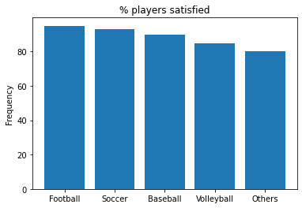
    


- From the above plot, we can understand better when compared with the pie chart.

- We can clearly see what % of players are satisfied with each game.

- Usually, we plot the bars in descending order (i.e. highest is first)

- Now lets plot a bar chart for the given dataset.


```python
#using matplotlib
#bar plot for currentSmoker feature

value_counts = df['currentSmoker'].value_counts()
labels = value_counts.index
counts = value_counts.values

plt.bar(labels,counts)
plt.xticks([0,1])
plt.ylabel('count')
plt.xlabel('currentSmoker')
plt.show()
```


    
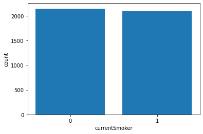
    


- From the above plot, we can say that number of currentSmokers is equal to the number of non-currentSmokers in the dataset.

- If you look at the code carefully, we have manually entered the xticks, xlabel and ylabel for the plot manually. If you don't want to go through all that you could do it by plotting the graphs using the seaborn package instead of matplotlib. 

- Seaborn library is built on top of the matploltib library. We could work with dataframes directly when we use the seaborn library. You could learn more about the <a href='https://seaborn.pydata.org'>features of seaborn here.</a>

- Seaborn plots important parameters:
   - x: data to plot on the x-axis
   - y: data to plot on the y-axis
   - hue: data for color encoding
   - data: Dataframe, array, or list of arrays 
- Note:
    - Use categorical data for hue


<a id='countplot'></a>
### Countplot
 - Shows the counts of values in each categorical feature using bins
 - We can't use data on both the x-axis and y-axis to plot countplot but we can use either on the x-axis or y-axis and hue.
 - <a href='https://seaborn.pydata.org/generated/seaborn.countplot.html'>read more about countplot here</a>


```python
#using seaborn
#count plot for currentSmoker feature

#currentSmoker on x-axis
sns.countplot(x='currentSmoker',data = df)
plt.title('Vertical Countplot')
plt.show()

#currentSmoker on y-axis
sns.countplot(y='currentSmoker',data = df)
plt.title('Horizontal Countplot')
plt.show()
```


    
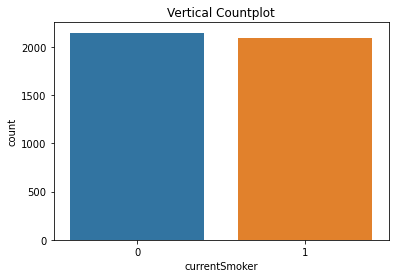
    


    
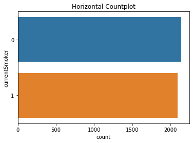
    


```python
#using seaborn
#count plot for currentSmoker and male features

#currentSmoker on x-axis and male feature as hue
sns.countplot(x='currentSmoker', hue='male',data = df)
plt.title('currentSmoker v/s Male vertical plot')
plt.show()


#currentSmoker on y-axis and male feature as hue
sns.countplot(y='currentSmoker', hue='male',data = df)
plt.title('currentSmoker v/s Male horizontal plot')
plt.show()
```


    
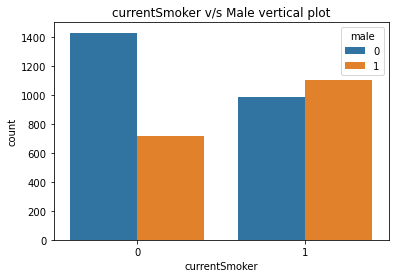
    


    
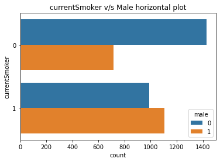
    


- By now, I hope you have understood what is x, y, hue, and data parameters.
- Horizontal bar charts are just like vertical bar charts except that the axes are flipped around. With horizontal bar charts, we show the categories on the vertical axis and the frequency or percentage on the horizontal axis.
- As you can see, it’s much easier to quickly gauge which category has the highest value, and which is the lowest when we use horizontal bar charts.
- In seaborn, using the countplots we only get the counts. But what if we want to use other than count? 
- Then barplot comes to our rescue.

<a id='barplot'></a>
### Bar Plot
- Bar plot shows the point estimates and confidence intervals.  
- In a bar plot, the height of each rectangle indicates the central tendency of a numeric variable and it also provides the uncertainty around that estimate.
- By default the estimator is mean.
- <a href='https://seaborn.pydata.org/generated/seaborn.barplot.html'>Seaborn Documentation</a>


```python
sns.barplot(y='BMI',x='TenYearCHD',data=df)
plt.title('TenYearCHD v/s BMI')
plt.show()
```


    
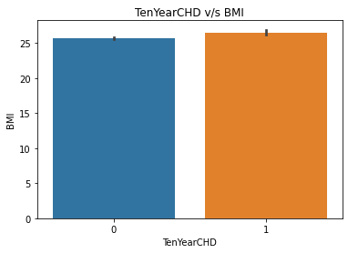
    


- From the above plot, we can say that the people who have more BMI have more probability of having the risk of heart disease.


```python
sns.barplot(x='currentSmoker', y='BMI',data=df, estimator=np.median)
plt.title('currentSmoker v/s BMI')
plt.show()
```


    
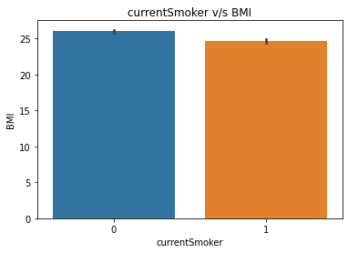
    


- From this plot, we can say that the current smoker has less bmi value compared to a non-smoker.


```python
sns.barplot(x='currentSmoker', y='BMI',hue='male',data=df)
plt.show()
```


    
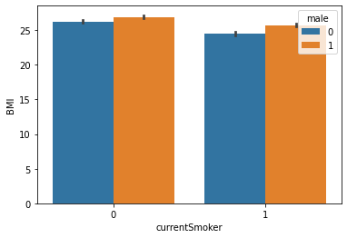
    


- From the above plot, we can say that the males have higher BMI compared to others, and also current smoker has less BMI compared to nonsmoker


```python
sns.barplot(x='currentSmoker', y='age',hue='TenYearCHD',data=df)
plt.show()
```


    
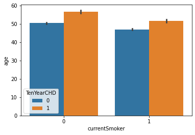
    


- From the above plot, we can say that the age of people who will have heart disease is higher than the age of people who don't have it. If the person is a current smoker then the average age decreases further.


```python
sns.barplot(x='diabetes', y='heartRate',hue='male',data=df)
plt.show()
```


    
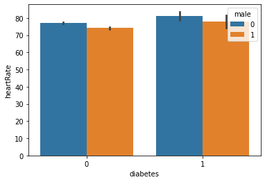
    


- From the above plot, we can say that the people who have diabetes have more heart rate compared to the people who don't have diabetes, and also the heart rate for males is less than others.

<a id='pointplot'></a>
### PointPlot
- Pointplot is similar to barplot but instead of rectangular bars, we have to scatter plot points to represent the point estimates and confidence intervals.
- <a href='https://seaborn.pydata.org/generated/seaborn.pointplot.html#seaborn.pointplot'>Seaborn Documentation</a>


```python
sns.pointplot(x='diabetes', y='heartRate',hue='male',data=df)
plt.show()
```


    
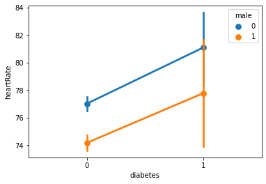
    


- We infer the same as the above barplot but it is easier for our eyes to understand the relationship between heart rate, diabetes, and gender when we use pointplot.
- Till now we have dealt with categorical features and at max one numerical feature but what if we want to understand the distribution of a numerical feature? 
- We can't use a bar chart.
- Now, we will be using Histogram.

<a id='histogram'></a>

# Histogram

### Histplot
- It represents the distribution of a numerical feature that are within discrete bins
- Important parameter:
    - bins: number of bins
- <a href='https://seaborn.pydata.org/generated/seaborn.histplot.html'>Seaborn Documentation</a>


```python
#visualizing the distribution of age
sns.histplot(x='age', bins=10, data=df)
plt.show()
```


    
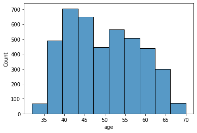
    


- From the above plot, we can say that the minimum age is somewhere near 17 and the maximum age is 70.
- Mode(Highest frequency) is when age is in the 40-45 range.
- Distribution of Age is right-skewed.


```python
#visualizing the age and male features
sns.histplot(x='age',hue='male', data=df)
plt.show()
```


    
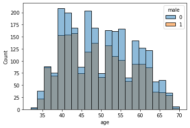
    


<a id='boxplot'></a>
# Box Plot
- It shows the comparison of distribution of different values of a feature or two different features.
- <a href='https://seaborn.pydata.org/generated/seaborn.boxplot.html'>Seaborn Documentation</a>


```python
sns.boxplot(x='male',y='heartRate', hue='currentSmoker', data=df)
plt.show()
```


    
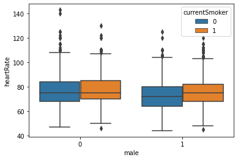
    


- From the above plot, we can say that approximate values of heart rate for different groups are as follows:
    |  Male    |  Current Smoker  | HeartRate [min, Q1, median, Q3, max] |
| :----------: | :-----------: |-----------:
| 0   |  0    | [46, 67, 74, 84, 110] | 
| 0   |  1    | [50, 69, 76, 85, 108] |
| 1   |  0    | [44, 64, 72, 80, 104] | 
| 1   |  1    | [46, 69, 76, 82, 102] |

<a id='violin'></a>
# Violin Plot
- It draws a combination of boxplot and kernel density estimate.
- <a href=''>Seaborn Documentation</a>


```python
sns.violinplot(x='male',y='heartRate', hue='currentSmoker', data=df)
plt.show()
```


    
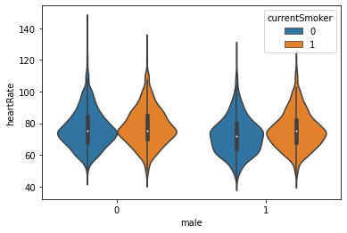
    


<a id='scatter'></a>
# Scatter Plot
- Draws dots to represent values for two different numeric features
- <a href='https://seaborn.pydata.org/generated/seaborn.scatterplot.html'>Seaborn Documentation</a>


```python
sns.scatterplot(x='sysBP',y='diaBP',hue='TenYearCHD', data=df)
plt.show()
```


    
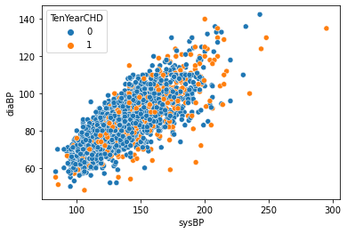
    


- Form the above plot we can say that there is a linear relationship between sysBP and diaBP. As sysBP increases diaBP increases.

<a id='strip'></a>
# Strip Plot
- Draws Scatterplot when one variable is categorical
- <a href='https://seaborn.pydata.org/generated/seaborn.stripplot.html'>Seaborn Documentation</a>


```python
plt.figure(figsize=(10,10))
sns.stripplot(x='male', y='heartRate', hue='currentSmoker',data=df)
plt.show()
```


    

    


<a id='swarm'></a>
# Swarm Plot
- Similar to stripplot but the points are adjusted so that they don't overlap.
- Doesn't scale well when we have a large number of observations
- <a href='https://seaborn.pydata.org/generated/seaborn.swarmplot.html'>Seaborn Documentation</a>


```python
plt.figure(figsize=(10,10))
sns.swarmplot(x='male', y='heartRate', hue='currentSmoker',data=df)
plt.show()
```


    
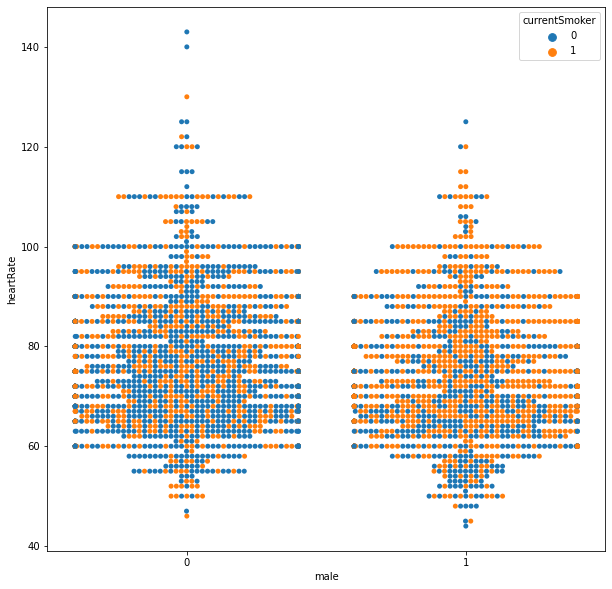
    


### Stripplot and swarm plots are good complements to box/violin plots


```python
plt.figure(figsize=(10,10))
sns.violinplot(x='male',y='heartRate', data=df)
sns.stripplot(x='male', y='heartRate', hue='currentSmoker',color='white',data=df)
plt.show()
```


    

    


```python
plt.figure(figsize=(20,20))
sns.violinplot(x='male',y='heartRate', data=df)
sns.swarmplot(x='male', y='heartRate', hue='currentSmoker',color='white',data=df)
plt.show()
```


    
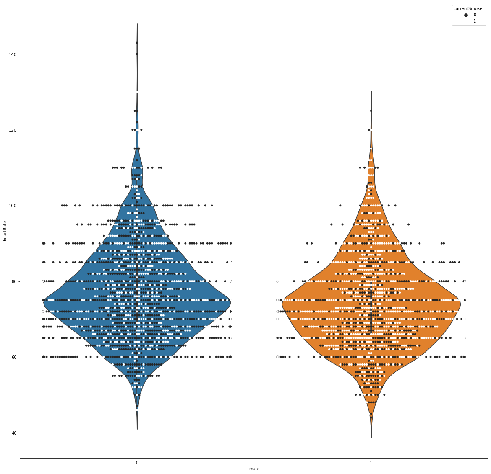
    


<a id='catplot'></a>
# Catplot

- Axes-level functions can be accessed using catplot to visualize the relationship between a numerical variable and one or more categorical variables using various visual representations.
- Plots that can be accessed using catplot are as follows:
    - countplot()
    - barplot()
    - pointplot()
    - boxplot()
    - violinplot()
    - boxenplot()
    - striplot()
    - swarmplot()
- Important Paramter:
    - kind: The kind of plot to draw. Options are “strip”, “swarm”, “box”, “violin”, “boxen”, “point”, “bar”, or “count”.
    
- <a href='https://seaborn.pydata.org/generated/seaborn.catplot.html'>Seaborn documentation</a>


```python
#box plot using catplot
sns.catplot(x='male',y='heartRate', data=df, kind='box')
plt.show()
```


    
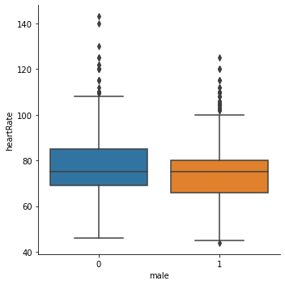
    


```python
#count plot using catplot
sns.catplot(x='diabetes', data=df, kind='count')
plt.show()
```


    
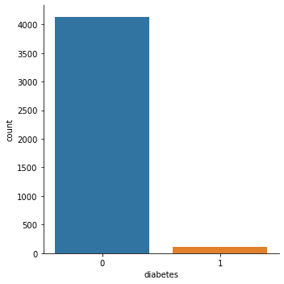
    


<a id='leftovers'></a>
## Leftovers :
- Line plot
- Displot
- Boxen plot
- Subplots
- Colors
- plt.annotate(), plt.text()
